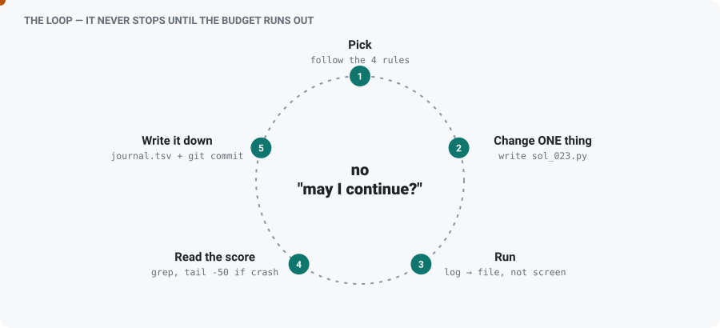
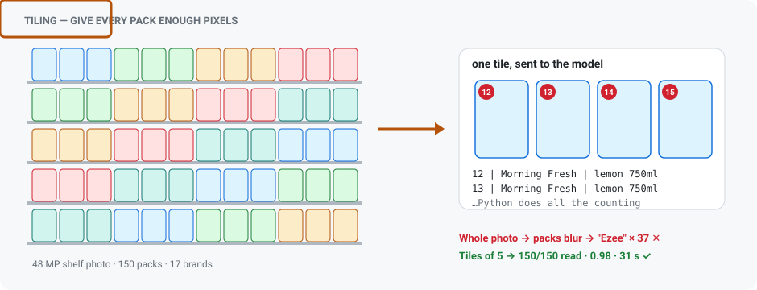
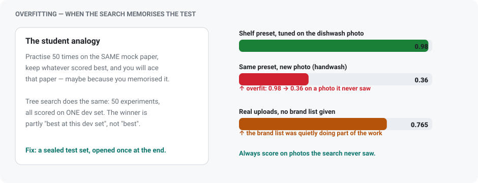
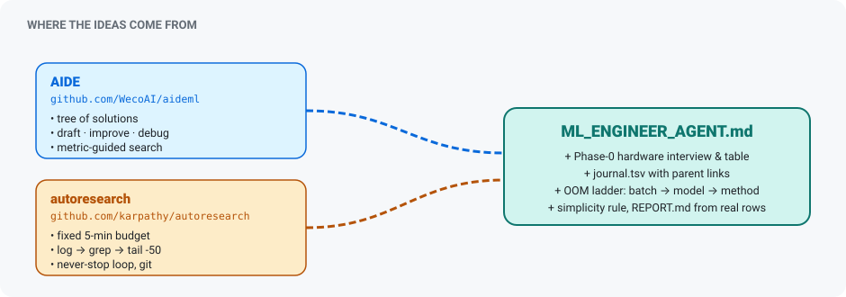

<div align="center">



# ML Engineer Agent: one Markdown file, 228 experiments

**The protocol I use to run ML experiments with a coding agent: one change at a time, every result written down.**


</div>

> **TL;DR:** Across 5 research projects I ran **228 experiments**. To keep them organised I wrote one protocol file,
> [`ML_ENGINEER_AGENT.md`](ML_ENGINEER_AGENT.md), and used it with a coding agent as an assistant. The agent wrote and ran
> the code and kept the log. I set the goals and metrics, checked the outputs myself, and decided what to keep.
> The core rule: change **one thing at a time**, and write down every result.
>
> | | Before | After |
> |---|---|---|
> | 📄 OCR, 5 languages, CPU only | 68–165 s/page | **~2 s/page** |
> | 🚀 DeepSeek-OCR on a 6 GB GPU | 98.25 s/page | **11.90 s/page**, identical output |
> | 🛒 Shelf audit in an 8 GB GPU slice | 235B model won't fit | **7B: 31 s at 6.46 GB** |
> | 🔐 Face check on an Android phone | 20.2 s | **1.75 s** |
>
> Every number comes from each project's experiment log (`journal.tsv`) or report. Nothing is estimated.
> The logs themselves aren't in this repo, because they contain company and student data.
> This covers **research work only**. Nothing here comes from calling a paid API.

### ⚡ Quick start

```bash
mkdir my-task && cd my-task && mkdir input            # put your data in ./input
curl -O https://raw.githubusercontent.com/krishna87777/ML_ENGINEER_AGENT/main/ML_ENGINEER_AGENT.md
# open your coding agent here and say:  "Read ML_ENGINEER_AGENT.md and follow it exactly."
```

Full guide: **[HOW_TO_USE.md](HOW_TO_USE.md)**

| File | What it is |
|---|---|
| [`ML_ENGINEER_AGENT.md`](ML_ENGINEER_AGENT.md) | The protocol: the file you give to the agent |
| [`HOW_TO_USE.md`](HOW_TO_USE.md) | Step-by-step usage, checks and common problems |
| `assets/` | Animated diagrams (`make_svgs.py` regenerates them) |

---

## Table of contents

0. [The idea in 60 seconds](#0-the-idea-in-60-seconds)
1. [The problem with "just try stuff"](#1-the-problem-with-just-try-stuff)
2. [How the file works, in plain language](#2-how-the-file-works-in-plain-language)
3. [The algorithm: tree search over experiments](#3-the-algorithm-tree-search-over-experiments)
4. [Before & after: results by project](#4-before--after-results-by-project)
5. [Lessons that kept coming back](#5-lessons-that-kept-coming-back)
6. [Limitations](#6-limitations)
7. [How to use it yourself](#7-how-to-use-it-yourself)
8. [References and related repos](#8-references-and-related-repos)

---

## 0. The idea in 60 seconds

Think of cooking a new dish. 🍳

- A **bad cook** changes the salt, the heat and the spices all at once. The dish gets better (or worse) and they don't know why.
- A **good cook** changes **one thing**, tastes, **writes it down in a notebook**, and keeps the best version.
  If a change ruins the dish, they go back to the best version and try something else.
  They also start with **three different recipes**, so they don't get stuck on the first one.

`ML_ENGINEER_AGENT.md` makes an AI agent into the good cook:

| Cooking | ML experiments |
|---|---|
| Recipe | a Python file, `sol_007.py` |
| Tasting | the score on a validation set |
| Notebook | `journal.tsv`, one row per experiment |
| "Go back to the best version" | always improve the **best node** in the tree |
| "Only one change per try" | the **atomic change** rule |
| "Don't burn the kitchen" | the **hardware table** and time limit |

That's it. The rest of this page covers the details, and what happened when I used it on real projects.

---

### Who did what

The file makes the agent a fast, disciplined assistant. It doesn't replace the researcher. This is how the work was actually split:

| I did | The agent did |
|---|---|
| Chose the problems, the hardware limits and the targets | Wrote the code for each experiment, from my plan or its own proposal |
| Designed the metrics and eval sets, and fixed them when they turned out wrong | Ran the experiments and kept `journal.tsv` up to date |
| Read real outputs and caught the leaks, the overfitting and the scorer bugs | Followed the tree search rules between my check-ins |
| Decided what to keep, what to ship and when to stop | Wrote first drafts of the reports from the journal |

---

## 1. The problem with "just try stuff"

When an AI agent (or a person) does ML experiments without rules, you usually see the same failures:

- It changes **five things at once**, so nobody knows which change helped.
- It **forgets** what it already tried and tries it again.
- It dumps 10,000 lines of training logs into its own memory and **loses track** of the goal.
- It **stops after one attempt** and asks "should I continue?"
- It reports a number that **looks good but was never checked properly**.

`ML_ENGINEER_AGENT.md` is a 190-line operating manual that removes each of these failures.
It combines two open ideas:

| Idea | Taken from | What it gives |
|---|---|---|
| Tree search over solutions | [AIDE (WecoAI/aideml)](https://github.com/WecoAI/aideml) | A smart way to decide *what to try next* |
| Persistence and clean context | Karpathy's *autoresearch* | Keeps going on its own and never floods its memory |

---

## 2. How the file works, in plain language

Think of the agent as a **junior researcher with a very strict lab notebook**.

### Phase 0: Ask before doing anything

Before writing any code, the agent must ask five questions and wait for the answers:

1. **What hardware?** (6 GB laptop GPU? CPU only? A100?) This is the most important one.
2. **What is the goal, and how do we score it?** (accuracy, seconds per page, and so on)
3. **Where is the data?**
4. **How long can one experiment take?** (default: 5 minutes)
5. **How many experiments in total?** (default: 20)

A built-in **hardware table** then limits what the agent may use. On a 6 GB card it cannot pick
a model that won't fit. If a run runs out of memory, that counts as a bug, and the agent shrinks things in a fixed
order: **batch size → model size → method**.

### Phase 1: Set up the lab notebook

Every experiment gets one row in `journal.tsv`:

```
id   parent  stage    status  metric  time_s  vram_gb  description                  summary
022  020     improve  good    41.97   ...     3.91     stack experts as int8 ...    new best, output identical
```

- `parent` records **which earlier experiment this one grew from**, which is what makes the log a tree.
- `description` is **what we planned**; `summary` is **what actually happened**.
- Every solution is a separate file (`sol_022.py`) and gets its own git commit.

If the agent loses its memory halfway through, it reads the journal and carries on from where it stopped.

### Phase 2: The experiment loop

The agent repeats this loop **without asking permission**:

<p align="center"></p>

In plain words: **pick → change one thing → run → read only the score → write it down → repeat.**

### Phase 3: Hand-in

When the budget runs out, the agent:
- copies the best experiment to `best_solution.py`,
- writes `REPORT.md` using **only numbers from the journal**,
- lists the **top 3 things that did NOT work**. Knowing what failed is as useful as the win.

---

## 3. The algorithm: tree search over experiments

Most people improve a model in a straight line: try A, then A+B, then A+B+C. If B was a mistake,
everything after it inherits the mistake.

This file treats experiments as a **tree**. Watch it grow:

<p align="center"></p>

- 🔵 **Draft**: a fresh, simple idea (a new root).
- 🟢 **Improve**: the best node plus **one** change.
- 🔴 **Bug**: it crashed. It gets up to 3 fix attempts, and then the branch is dropped.
- ⚪ **Abandoned**: it was worse. It stays in the log so it's never tried again, but nothing builds on it.
- ⭐ **Best**: the "best" badge always moves to the top-scoring node, and the next improvement starts from there.

### Step 1: Deciding what to do next (fixed rules)

Before every experiment the agent works through these rules in order and uses the first one that matches:

| # | Situation | Action |
|---|---|---|
| 1 | Fewer than 3 starting points exist | **DRAFT** a new, simple, different approach |
| 2 | A broken experiment exists, it has been fixed fewer than 3 times, and the step number is odd | **DEBUG** it |
| 3 | Nothing works yet | **DRAFT** another approach |
| 4 | Otherwise | **IMPROVE** the current best, changing exactly one thing |

In plain words:
- **Start wide.** Three different ideas stop you from getting stuck on the first one.
- **Fix bugs about half the time**, but give up on a branch after 3 failed fixes.
- **Always build on the current best**, even if it's an old experiment. Bad branches are simply left behind.

### Step 2: One change at a time

Each improvement must be **one single, testable change**, such as "raise the learning rate from 3e-6 to 3e-5".
If the score moves, you know exactly why.

There is also a **simplicity rule**: if two versions score the same, the one with less code wins.

### Step 3: Keeping the agent's memory clean

Training prints huge logs. The agent is **never allowed to read them in full**:

```bash
python sol_022.py > run_022.log 2>&1           # everything goes to a file
grep "VALIDATION_METRIC:" run_022.log          # read only the score
tail -n 50 run_022.log                         # only if it crashed
```

That lets it run 50+ experiments in one session without losing track of the goal. Any run that takes
more than twice the time budget is stopped and marked as a crash.

### Step 4: Structured review

After every run the agent fills in the same four fields: **is it a bug? what's the score? is lower
better? one-line summary.** This means the decisions come from recorded facts, not from a feeling that it went well.

---

## 4. Before & after: results by project

<p align="center"></p>

| Project | Experiments logged | Before | After |
|---|---|---|---|
| Multilingual CPU OCR | 47 | 68–165 s/page (0.9B VLM) | **~2 s/page**, CPU only |
| DeepSeek-OCR speed (GPU) | 20 | 98.25 s/page | **11.90 s/page**, identical output |
| DeepSeek-OCR speed (CPU) | 9 | torch: 310 s, **0 tokens** | **72.2 s/page**, 4.74 GB RAM |
| Face SDK (Android) | 57 | 20.2 s per verification | **1.75 s**, 0% attacks passed |
| Post-training study (10 methods) | 23 | reward model 0.56 | **0.70** |
| Shelf audit with a local vision model (8 GB cap) | 72 | 235B/30B models (69 GB / 18 GB) don't fit, whole-image reads loop | **235B in 7.5 GB; 7B in 31 s at 6.46 GB**, 0.98 / F1 1.00 |
| **Total** | **228** | | |

---

### 4.1 Multilingual OCR on CPU: invoices, POs and receipts

**Goal:** read printed **and handwritten** documents in English, Hindi, Bengali, Tamil and Telugu,
on a laptop CPU, in under 2 seconds per page, with no GPU and no cloud.

**Before:** the vision-language models we tried first needed **68–165 s per page**.

**After:** **~2 s/page** on a laptop CPU, ~300 MB of models, ~2 GB RAM, and our own
**12.5 MB recogniser reads all 5 languages in one model**.

| Word accuracy (same test set) | Stock PaddleOCR | **Ours** |
|---|---|---|
| English (scanned) | 87.8 % | **97.6 %** |
| Hindi / Bengali / Tamil / Telugu (scanned) | 26–71 % | **83–87 %** |
| Indic digital PDFs | 44–97 % | **97–100 %** |
| Handwriting (5 languages) | 5–65 %, no Bengali/Telugu | **75–94 %** |
| Numbers | 84.3 % | **98.5 %** |
| Tables (TEDS) | none | **0.80** (0.94 on invoice tables) |
| Reading-order error (lower is better) | 0.36 | **0.10** |

**How it works, step by step:**
1. **Digital PDF?** Use its hidden text layer, but first check it isn't broken (bad Indic font maps are common).
2. **Scanned page?** Fix rotation (a 180° flip is double-checked with the recogniser) and straighten any tilt.
3. **Find the text lines** with a small detector. If the text is tiny, look again at higher resolution.
4. **Read the text** with one recogniser we fine-tuned on 729 characters: Latin plus four Indic scripts, printed plus handwritten.
5. **Clean up the mistakes** with a dictionary, and fix look-alike characters (G↔C, O↔0). A correction is **only kept if the model itself agrees** it fits.
6. **Layout, tables and reading order**, so the output comes out as structured text.

**What the checks caught:**
- **Data leakage.** Some Bengali handwriting writers copied the same texts, so test text had leaked into training.
  Node 020 was marked invalid and the training data was rebuilt so no text is shared with the test set.
- **Dictionary memorisation.** The correction dictionary had included handwriting answers. It was rebuilt from Wikipedia only.
- **Things that did not work:** test-time augmentation (Hindi handwriting went *down* from .728 to .623),
  int8 recogniser (20% faster but only 89% identical output), plain edit-distance correction.

**Next:** old or damaged Indic book scans, and Hindi/Telugu handwriting (currently 75–78 %).

---

### 4.2 DeepSeek-OCR: from 98 s to 12 s per page on a 6 GB laptop GPU

**Goal:** students photograph handwritten notes, and the app needs to read them. The only GPU was an
**RTX 4050 Laptop with 6 GB**. The 3B DeepSeek-OCR model took **98.25 s per page**, so a 36-page PDF took an hour.

**The key discovery:** at the start the GPU was only **2% busy**. Each generated token took 57.6 ms,
of which just 14.4 ms was real GPU work. The rest was overhead: 1,641 kernel launches and 664 type
conversions *per token*. So the model wasn't slow at maths. It was waiting on overhead.

| Step | Change (one at a time) | s/page | Speed-up | Output same? |
|---|---|---|---|---|
| 000 | Baseline | 98.25 | 1.00× | ✅ |
| 002 | Remove CPU↔GPU sync stalls in the MoE layers | 81.40 | 1.21× | ✅ |
| 020 | Compute the output layer only for the last token, and use a custom loop | 64.32 | 1.53× | ✅ |
| 022 | Pack the 64 experts into int8, using the same block size as 4-bit | 41.97 | 2.34× | ✅ |
| 024 | Record the whole token step once and replay it (CUDA graph) | 34.16 | 2.88× | ✅ |
| 031 | **Custom Triton kernel** that reads int8 weights once and unpacks them in registers | 18.01 | 5.46× | ✅ |
| **036** | Fast output layer on printed pages, exact one on handwriting | **11.90** | **8.26×** | ✅ |

**Four lessons from this one:**
1. **Measure first.** The vision encoder looked like the obvious target, but it was only 0.4–2.1 s of a ~100 s page.
   Measuring it first saved weeks of work on the wrong part.
2. **"GPU at 98%" doesn't mean efficient.** After step 024 the GPU looked maxed out, but it was moving
   data at 51 GB/s on a card that can do 187 GB/s. The fused Triton kernel reached **153.7 GB/s**.
3. **"More bits" isn't always "more precise".** int8 with one scale per row was *coarser* than the 4-bit
   it replaced, and the output changed. Matching 4-bit's 64-weight blocks fixed it.
4. **The scoring code itself had bugs**, and they were hiding real improvements. Some nodes read the handwriting
   *better* than the reference but were scored as worse. So I added an independent checker (`truth.py`).

Experiments that failed and were kept in the log: a smaller KV cache (cut off long pages), dropping the n-gram ban
(slower), turning off crop mode (worse and slower), and fp16 experts (ran out of memory on 6 GB).

#### Round 2: the same model with **no GPU at all**

| Node | Setup | s/page | RAM |
|---|---|---|---|
| 100 | PyTorch on CPU | **310 s and 0 tokens produced**, unusable | 6.83 GB |
| 101 | llama.cpp, Q8_0 | 127.89 | 4.96 GB |
| 103 | Q4_K_M (smaller) | 94.69, but **quality collapsed to 0.42** ✗ | 5.23 GB |
| 104 | Thread sweep 4/6/8/12/16 | best at **12** (72.6 s); 16 is slower | — |
| 105 | **Shrink the page to 640 px** | 79.27 | 5.21 GB |
| **107** | **Q6_K + 640 px** | **72.20** | **4.74 GB** |

**The biggest CPU finding:** image encoding time jumps in a step instead of changing smoothly. At 2200, 1024 and 800 px
it costs the same ~47 s, because the model cuts anything larger than 640 into 7 tiles. At 640 px it takes one path and costs **17 s**.
One resize did more than every other CPU trick combined. Also, **6-bit was the right quantisation**:
8-bit wastes memory bandwidth and 4-bit breaks the model.

Final CPU speed: **72.2 s/page, 6.1× slower than the tuned GPU**. The measurements show this is the limit of this
machine, not a tuning mistake, because the model costs a flat ~62 ms per token on this CPU.

---

### 4.3 Face recognition and anti-spoofing SDK for Android

**Goal:** replace a paid face SDK with our own that runs **fully on the phone**, with no internet.

| Metric | Result |
|---|---|
| Face verification (LFW, 6,000 pairs) | **99.85 % ± 0.17 %** |
| Cross-age (AgeDB-30, 30-year gaps) | **96.39 %** |
| Photo/screen attacks reaching "live" | **0.0000 % of 2,400** |
| Full verification on phone | 20.2 s → **1.75 s** |
| Automated tests | 50 distinct, 0 failures |

**How the anti-spoofing works:** it uses two independent checks.
1. **Texture check.** A small CNN looks for signs of a screen or print. It was retrained after a
   "phone held close" bug, using zoomed-in training images.
2. **3D motion check.** Over about 1 second the SDK tracks pixels on the face with optical flow. A flat photo moves like
   one flat sheet (a single homography fits it). A real face doesn't, because the nose and cheeks move differently.

**How it got 10× faster:** I timed every stage and found **optical flow was 96% of the total**,
while the actual face recognition took just 31 ms. Instead of cutting one setting drastically, it trimmed four settings moderately:
points 400→200, pairs 6→3, iterations 30→12, window 21→15. Flow dropped from 16,440 ms to 1,009 ms, and the security result
was proven unchanged against the Python reference.

It also replaced a **137 MB 3D-landmark model** with an averaged face-depth profile and ported the whole pipeline to pure Kotlin
with **no OpenCV**, all matching Python to 1e-4 px.

---

### 4.4 Post-training study: 10 methods, one model, one 6 GB GPU

**Goal:** run SFT, DPO, PPO, GRPO, RLOO, REINFORCE, reward model, ORM, PRM, agentic RL and multi-turn RL
on the **same** Qwen3-1.7B model and data, then report honestly what each one does.

- **SFT won (0.210)**, but PPO, DPO, agentic and multi-turn are **statistically tied** with it.
- I measured the **ceiling first**: 46% of questions have more than one correct answer, so the maximum possible
  is about **0.45**. That makes 0.21 about 47% of what's achievable, not 21%.
- With a plain 0/1 reward, **83% of RL groups would learn nothing**, because every sample in the group gets the same reward. A graded reward cut
  that to 0.67%, giving 6× more steps that actually teach the model something.
- It caught a **reward hack**: training reward went up (0.381 → 0.421) while real accuracy went down.
- **Reward model: 0.5625 → 0.7045** from one change, 5× more preference pairs.

---

### 4.5 Shelf audit: huge vision models inside an 8 GB GPU slice

**Goal:** read every product on a supermarket shelf photo (brand, variant, how many facings, which shelf it sits on)
with a model **we host ourselves**. The output had to match the big cloud model's audit report. It took **72 logged experiments over 9 days**,
with 4 models and 5 shelf types.

#### The hardware problem

The research ran on two machines, and both were tight:

| Machine | What we had | The catch |
|---|---|---|
| Personal laptop (day 1) | RTX 4050, **6 GB VRAM**, 14 GB RAM, internet at 0.35–1 MB/s | The smallest 235B file (~86 GB) is bigger than RAM + VRAM combined (~20 GB) |
| Shared cloud server | RTX PRO 6000 with 96 GB, **but a production voice/TTS system used ~78–95 GB of it** | Free VRAM swung between **2 and 19 GB** during the day. We set a **hard 8 GB cap** so production was never touched |

Other limits on the server: no CUDA toolkit (so we used prebuilt **Vulkan llama.cpp**), a slow spinning disk
(~467 MB/s), 16 shared CPU cores, about 25 GB of free RAM and zero swap.

For scale: the models we wanted weigh **18 GB (Qwen3-VL-30B)** and **69 GB (Qwen3-VL-235B)** even after
compression, and our budget was **8 GB**.

#### Safety first: the VRAM guard

Before running any experiment, I set up `vram_guard.sh`:
- It records total GPU memory, starts our command, and re-checks every **0.4 s**.
- It measures the **increase** in total GPU memory, because Vulkan memory doesn't show up per process in `nvidia-smi`.
- If our increase goes above **7.9 GB**, it kills **only our own processes** (`pkill -9 -g`).
- It prints `PEAK_VRAM_GB` for the journal.

It fired 9 times during the research. One case was run G20, when production came back to the GPU in the middle of a run.
**Production was never disturbed.** The agent relaunched with a smaller setting and the run completed at 7.04 GB.

#### Trick 1: MoE expert offload (the main technique)

<p align="center"></p>

**In plain words:** imagine a library with 48 huge bookshelves (the "experts"), where each question only needs 2–3 of them.
You don't need every shelf on your desk (the GPU). Keep the reading lamp and index (attention) on the desk, leave the shelves in the
back room (CPU RAM), and bring the most-used ones to the desk if there's space.

Qwen3-VL-30B is a **Mixture-of-Experts** model. It has 30B parameters, but only ~3B are used for any one token.
Its weights come in two kinds:

- **Attention, router and norms:** small, and used on **every** token. These go on the **GPU**.
- **Expert FFN weights:** huge, but each token only uses a few of them. These go in **CPU RAM**.

llama.cpp lets you choose where each tensor goes using a regex:

```bash
-ngl 999                                                  # offer every layer to the GPU ...
-ot "\.ffn_.*_exps\.weight=CPU"                           # ... then pull ALL experts back to CPU  (~1.4 GB VRAM)
-ot "blk\.(1[4-9]|[2-4][0-9])\.ffn_.*_exps\.weight=CPU"   # keep expert layers 0-13 on GPU        (the 8 GB ceiling)
-ot "ZZZ_NOMATCH=CPU"                                     # matches nothing -> everything on GPU  (for the dense 7B)
```

**The number of expert layers kept on the GPU works like a speed dial, and VRAM limits how far you can turn it.**
I measured it step by step (30B, text-only benchmark):

| Expert layers on GPU | Generation speed | VRAM |
|---|---|---|
| 0 (all on CPU) | 8.64 tok/s | 1.30 GB, always loads |
| 12 | 13.19 tok/s (+53%) | 4.88 GB |
| 20 | 14.13 tok/s | 6.90 GB in the benchmark, but **7.74 GB with a real context**, so the guard killed it |

I **found the ceiling by letting runs fail on purpose**, instead of guessing: 25 layers hit 9.06 GB (killed),
16 hit 7.75 GB (killed), 12 fit, and **14 fit at 7.64 GB**.

This let a **235B model write coherent text using only 5.2 GB of VRAM**, with 85 GB of experts
streamed from disk (slowly, at 0.4 tok/s).

**Why not AirLLM?** AirLLM loads whole layers, all 128 experts included, on every token, which means reading about 86 GB per token.
llama.cpp reads only the few experts each token actually uses.

#### The wall: resolution vs VRAM

The first attempts sent the **whole 48-megapixel shelf photo** to the model at once:

| Try | Result |
|---|---|
| 30B, whole image at 4096 image tokens | Got stuck in a loop and labelled **all 37 boxes "Ezee"** |
| 235B (1.7-bit, in RAM), 6144 image tokens | **Out of memory**: the guard tripped at 8.68 GB |
| 235B, 4096 image tokens and a smaller context | **Out of memory** at 8.14 GB |

What I found: at an image size that fits in 8 GB, the model **can't tell 149 small packs apart**.
Giving it enough resolution to tell them apart pushes VRAM past 8 GB. **The 235B's base alone is ~8.5 GB.**

#### Trick 2: tiling (the breakthrough)

<p align="center"></p>

Rather than one huge image, the pipeline:
1. finds every product with the existing **YOLO detector** (on the CPU),
2. counts the shelves from the full photo,
3. cuts the photo into **small high-resolution tiles** with a few boxes each, and draws a number on every box,
4. asks the model to read each tile ("box 12 = Morning Fresh, lemon, 750 ml"),
5. merges the answers by box number and **does all the counting in Python, never in the model**.

A small tile needs few image tokens, so memory stays small, **and** each pack gets many pixels.
**VRAM depends on tile size, not photo size.** A 240-product pharmacy shelf in 31 tiles used the same 7.67 GB as a small photo.

Results on the benchmark shelf (dishwash, 150 packs, 17 brands):

| Model | Similarity | Brand F1 | Time | VRAM | How it fit |
|---|---|---|---|---|---|
| 235B (1.7-bit) | **0.98** | **1.00** | 37 min | 7.51 GB | experts in RAM/disk, tiles |
| 30B (4-bit) | **0.98** | **1.00** | 3.6 min | 7.64 GB | 14 of 48 expert layers on GPU |
| 30B, GPU free for once | 0.98 | 1.00 | **21 s** | 18.7 GB | all on GPU (220 tok/s) |

Small changes that each added accuracy, one experiment at a time:
- **Brand name clean-up** ("MORNING FRESH", "Vege" and "VEGE" mapped to one brand): 0.90 → **0.97**, at no cost.
- **Taking the word "JSON" out of the prompt.** It had made the model wrap its output. Plain `box | brand | variant` lines gave 0.97 → **0.98**, F1 1.00, and ran faster.
- **Loading the model once with `llama-server`** instead of once per tile: about 9× less total time.

#### Trick 3: quantisation, in numbers

| Model | Full size | After compression | Format |
|---|---|---|---|
| Qwen3-VL-235B | ~470 GB | **69 GB** | IQ1_M (~1.7-bit) |
| Qwen3-VL-30B | ~60 GB | **18 GB** | Q4_K_XL (4-bit) |
| Qwen2.5-VL-7B | ~15 GB | **4.7 GB** | Q4_K_M (4-bit) |

Where the 8 GB goes for the 30B:

```
attention + other small weights     1.5 – 2 GB
14 of 48 expert layers              ~4 GB
vision encoder (mmproj)             ~1.1 GB
image tokens + KV cache (q8_0)      0.5 – 1 GB
-------------------------------------------------
total                               ~7.6 GB   (7.64 measured)
```

#### Trick 4: switch to a small dense 7B that fits completely

The 30B still had to push most of its experts to the CPU, so it couldn't go faster than ~3.6 min under 8 GB.
I tried **Qwen2.5-VL-7B**, a dense 4.7 GB model where **every layer fits on the GPU**. It ran at ~61 tok/s at 6.46 GB.
First run: 0.94 / 0.92 in 68 s. Then **12 experiments, one change each**:

| # | One change | Similarity | Brand F1 | Time | Verdict |
|---|---|---|---|---|---|
| 001 | baseline (8 boxes per tile) | 0.937 | 0.919 | 62.5 s | start |
| 002 | higher image resolution | 0.873 | 0.914 | 81.6 s | ✗ **worse**, splits one pack into two |
| 003 | show the brand list **before** the image | 0.950 | 0.971 | 74.4 s | ✓ |
| 004 | + a second "re-read unclear boxes" pass | 0.950 | 0.971 | 89.1 s | ✗ no gain, 20% slower |
| 005 | cheap Python "fill the gaps" rule instead | 0.960 | **1.00** | **34.5 s** | ✓ beats a second model pass |
| 007 | 6 boxes per tile | 0.953 | 1.00 | 34.9 s | ✓ right direction |
| **008** | **5 boxes per tile + bigger crop** | **0.98** | **1.00** | **31.2 s** | 🎯 **target hit** |
| 010 | 4 boxes per tile | 0.967 | 0.970 | 41.9 s | ✗ past the best point |
| 011 | even bigger crop | 0.960 | 1.00 | 91.9 s | ✗ worse on both |

**Why fewer boxes per tile made it both better and faster:** each pack gets more pixels, **and** the model writes fewer tokens per tile.

#### Before → after, summed up

| | Before | After |
|---|---|---|
| Belief | "only a huge cloud model can read a shelf" | a **7B** matches it once the image is tiled |
| Whole-image 30B | stuck in a loop, same brand on every box | 150/150 boxes read |
| 235B | doesn't fit (8.68 GB, out of memory) | fits in **7.51 GB**, 0.98 / 1.00 |
| Best under 8 GB | 30B in 3.6 min at 7.64 GB | **7B in 31 s at 6.46 GB** |
| Cost per image / data leaves the company | paid, and yes | **0, and no** |

#### Honest status (what is not solved)

- The 0.98 was measured on **one clean shelf with the brand list given**. The same settings on the handwash photo scored **0.36 / 0.41**, so a preset tuned on one image doesn't carry over.
- On real uploads **with no brand list**: shelf structure is now exact (7 of 7 shelves, after I found a **Python geometry bug**, not a model bug), but brand reading is **0.765 / 0.64**. The 7B makes up brand names from scent and colour words.
- Runs are **not repeatable even at temperature 0**, because the server's 4 slots batch tiles differently each time: the same image took 35 s once and 90 s another time. Compare with `--parallel 1` or average 3 runs.
- **Most useful lesson from this project:** the numbers looked great (99% named) while one "shelf" in the report held 54 boxes.
  **Never accept a metric without checking a few rows by eye.**

---

## 5. Lessons that kept coming back

1. **Check real outputs, not just the score.** In the shelf audit, 99% of boxes were named and the brand share looked close, but one "shelf" in the report held 54 boxes.
2. **Measure before you optimise.** The vision encoder (OCR) and recognition (face) looked like the problems. They weren't.
3. **Silent config bugs cost more than bad algorithms.** Examples: ONNX Runtime 1.23 crashed the phone app with no error message; llama.cpp offloads to the GPU by default (`-ngl 999`), so a "CPU" test would quietly have measured the GPU; a guessed thread count was wrong. None of them printed a warning.
4. **Your scorer can lie.** It was wrong twice in DeepSeek-OCR, and both times it hid real improvements.
5. **Resolution before scale.** Check how many pixels each object gets before buying a bigger model.
6. **State the ceiling.** 0.21 means little until you know the maximum possible is 0.45.
7. **Write down what failed.** Every report lists its failures, which is why the good numbers can be trusted.

---

## 6. Limitations

The agent is a hard-working junior researcher, **not** a replacement for judgement. These are the real problems I hit.

<p align="center"></p>

- **⚠️ It can overfit.** It tries dozens of ideas on one dev set and keeps the best, so part of that "best" is luck on that set.
  A shelf preset scored **0.98 on its tuning photo and 0.36 on a new one**. In OCR, copied Bengali texts leaked test sentences into
  training, and that experiment was marked invalid.
  → *Keep a sealed test set, open it once at the end, and split data by source (writer, document), not by row.*
- **🎯 It is only as good as the metric.** A scorer with its own mistakes made better OCR transcriptions look like failures,
  and in the RL study, reward went up while real accuracy went down (reward hacking).
  → *Read 10–20 real outputs by eye. The biggest bugs here were caught that way, not by the metric.*
- **🎲 Small eval sets give noisy winners.** DeepSeek-OCR was tuned on 3 pages, and the RL study's ~100 rows mean ±5 points.
  → *Re-run close winners with 2–3 seeds before calling it a result.*
- **🔁 Runs aren't always repeatable.** The same shelf image took 35 s once and 90 s the next time, even at temperature 0.
  → *Fix seeds and server slots (`--parallel 1`), or average 3 runs.*
- **🐢 One change at a time is slow** when two changes only help together, and the 5-minute budget doesn't fit long training runs.
  → *Raise the budget for big runs, and allow a paired change when the log shows the two changes are linked.*
- **🧭 It can't choose the goal.** A human still decides what "good" means, which data is fair, and when to stop.

---

## 7. How to use it yourself

> 📘 **Full step-by-step guide:** [HOW_TO_USE.md](HOW_TO_USE.md). It covers the setup questions, watching the journal, reading results, checking for overfitting and common problems.

1. Put `ML_ENGINEER_AGENT.md` in your project folder, with your data in `./input`.
2. Open a coding agent (Claude Code, Cursor, Aider, Codex CLI…) in that folder and say:
   > *"Read ML_ENGINEER_AGENT.md and follow it."*
3. Answer the 5 setup questions (hardware, goal and metric, data, time per run, total budget).
4. Let it run. Watch `journal.tsv` grow. At the end, read `REPORT.md` and `best_solution.py`.

**Quick reference card** (from the file):

```
SETUP:  ask hardware -> ask task+metric -> inspect data -> branch + journal.tsv
LOOP:   <3 drafts? draft : buggy leaf & depth<=3 & odd step? debug
        : no good node? draft : improve BEST with ONE atomic change
WRITE:  single file, prints VALIDATION_METRIC, fits hardware+time budget
RUN:    redirect to log, grep metric, tail -50 on failure, kill at 2x budget
LOG:    journal.tsv row + git commit, structured verdict
REPEAT: never stop until budget exhausted -> best_solution.py + REPORT.md
```

**Credits:** see [References](#8-references-and-related-repos).

---

## 8. References and related repos

`ML_ENGINEER_AGENT.md` is a mix of two open projects, plus rules I added from my own mistakes.

<p align="center"></p>

### The two direct sources

| Repo | What it is | What I took from it |
|---|---|---|
| [**WecoAI/aideml**](https://github.com/WecoAI/aideml) (AIDE) | An LLM agent for ML engineering, built around **agentic tree search**: every Python solution is a node, and every new patch is a child node | The solution tree; the draft / improve / debug stages; parent → child experiments; metric-guided choice of the next step; "the LLM writes the whole ML script" |
| [**karpathy/autoresearch**](https://github.com/karpathy/autoresearch) | AI agents running research on single-GPU nanochat training automatically, driven by one `program.md` | Fixed ~5-minute budget per run; redirect output to a log; `grep` the metric; `tail -50` only on failure; keep what helps and revert what doesn't; record every run; **keep going without asking the human** |

How each rule in my file maps back:

| Rule in `ML_ENGINEER_AGENT.md` | AIDE | autoresearch | Added by me |
|---|:---:|:---:|:---:|
| Tree of solutions (draft / improve / debug) | ✅ | | |
| Improve the best node with one atomic change | ✅ | | |
| Max 3 debug tries, then drop the branch | ✅ | | |
| Fixed time budget per experiment, kill at 2× | | ✅ | |
| Log to file → grep metric → `tail -50` on crash | | ✅ | |
| Never stop to ask "should I continue?" | | ✅ | |
| Git commit per experiment | | ✅ | |
| Simplicity rule (equal score + less code = win) | | ✅ | |
| Phase-0 hardware interview + hardware table | | | ✅ |
| `journal.tsv` with parent links, VRAM and summary | | | ✅ |
| OOM ladder: batch → model → method | | | ✅ |
| `REPORT.md` built only from journal rows + "top 3 failures" | | | ✅ |

### Newer projects built on the same idea (worth a look)

| Repo | What it adds |
|---|---|
| [iii-experimental/n-autoresearch](https://github.com/iii-experimental/n-autoresearch) | autoresearch with **multi-GPU parallel** experiments, structured experiment tracking, adaptive search and crash recovery |
| [ClergeF/autoresearch-engine](https://github.com/ClergeF/autoresearch-engine) | Packages the autoresearch loop (edit `train.py` → run → evaluate → log) as a reusable engine |
| [menonpg/autoloop](https://github.com/menonpg/autoloop) | "autoresearch for everything": the same improve-measure loop for **any** system, not just ML training |
| [lamawithonel/karpathy-autoresearch-skill](https://github.com/lamawithonel/karpathy-autoresearch-skill) | The autoresearch method packaged as an **agent skill** |

*All six repos were checked to exist on GitHub on 30 Sep 2026.*
